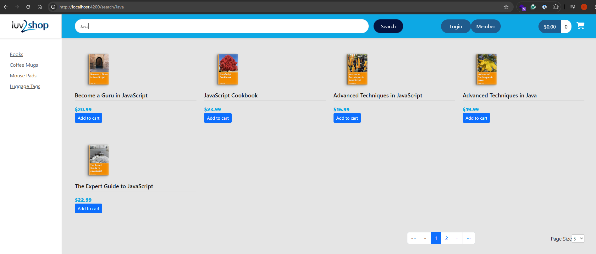
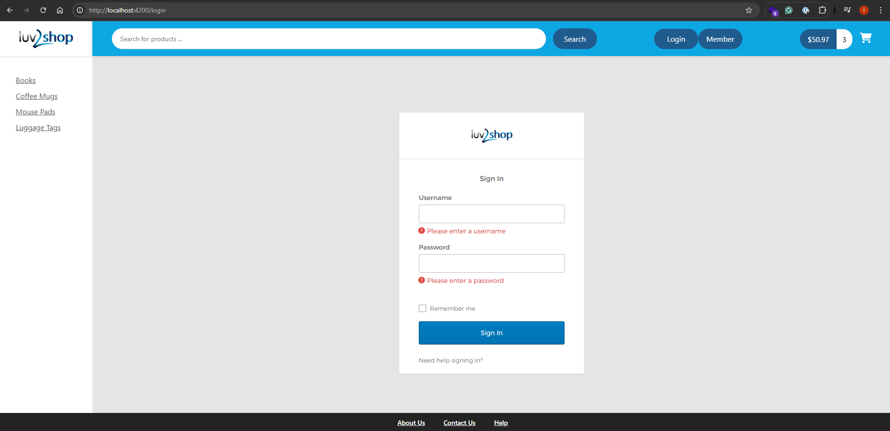
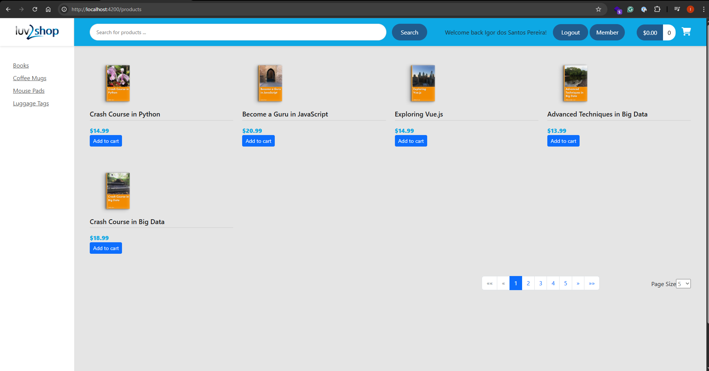
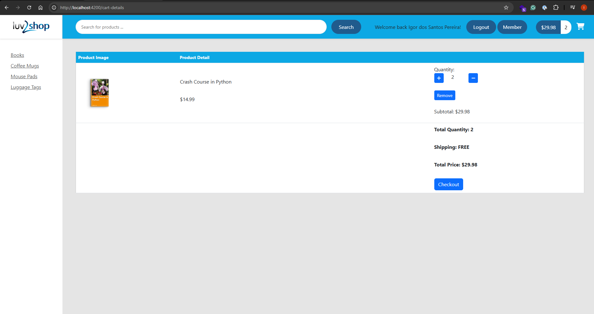
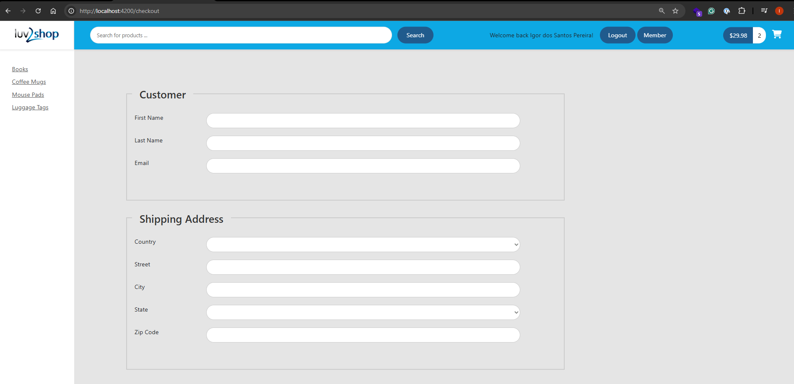
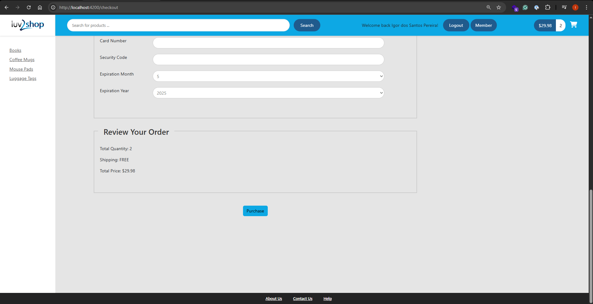

Technologies used in the project:

Angular 18

HTML 5

CSS

TypeScript

Okta (SSO API)

Stripe (Payment Gateway API)

HTTPS/SSL

-------------------------------------------------------------------------

Link to back-end project: https://github.com/IgorPTW/ecommerce-backend

-------------------------------------------------------------------------

Screenshots:

